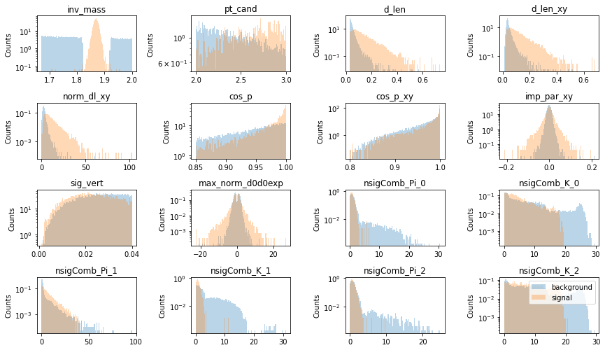
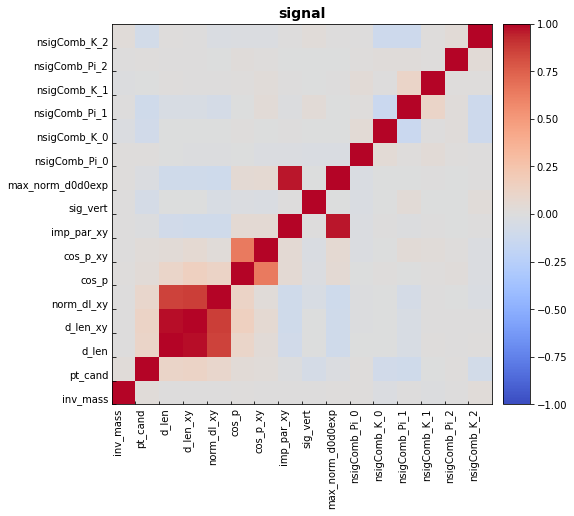
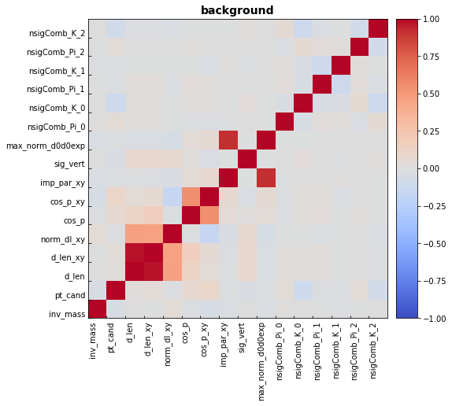
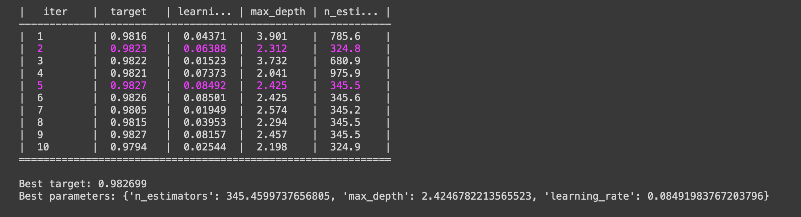
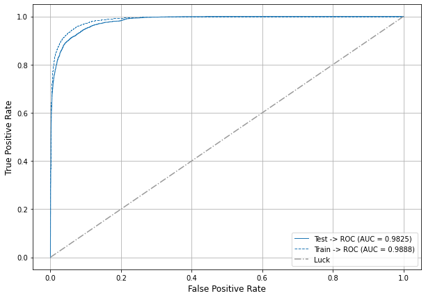
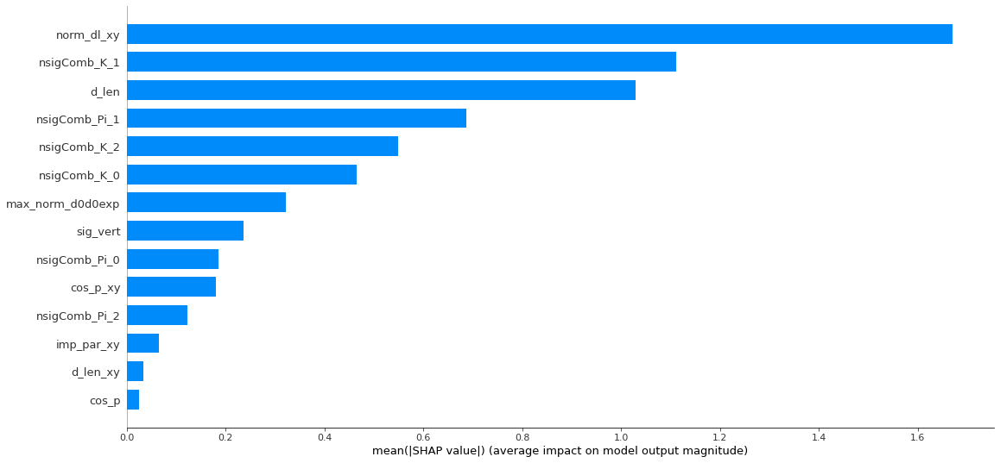
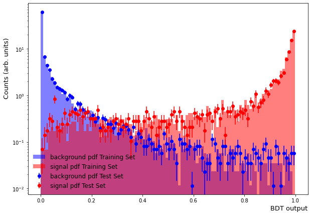
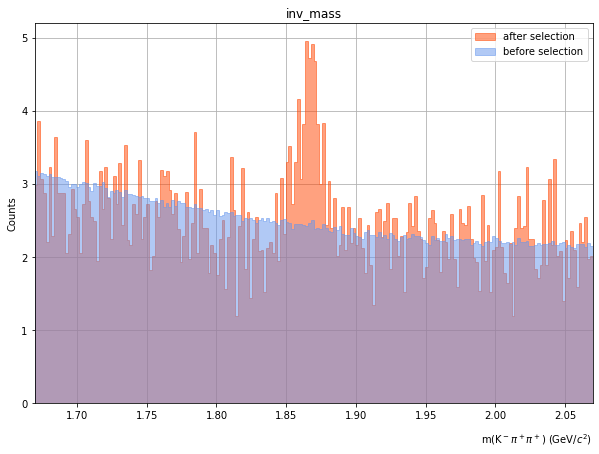

# Fundamentals of Big Data Analytics
------------
## $\rm D^+$ selection with Boost Decision Tree (BDT)
---

## Intorduction <br><br>

138억 년 전 우주는 거대한 폭발(Big-Bang)로 시작되었다. 
현대 물리학의 중요한 숙제중의 하나는 이 Big-Bang 직후의 우주 상태를 알아내는 것이다. Big-Bang이 일어난 직후 우주의 에너지 밀도와 온도는 상상을 뛰어넘게 높았을 것이라 예측된다.
우주의 나이가 약 100 만분의 1초 정도였을 때의 우주의 상태를 쿼크-글루온 플라즈마(quark-gluon plasma, 또는 QGP)라고 한다.

우주의 초기 상태로 돌아가 쿼크-글루온 플라즈마를 관측하는 것은 불가능하지만 작은 수의 소립자로 이루어진 계라도 중이온 가속기를 이용하여 초고온의 상태를 만듦으로서 그와 유사한 상태를 만들어, 우주 초기 상태를 연구할 수 있다. 
중이온 가속기를 이용해 무거운 원자핵(중이온)들의 충돌시키면 충돌 중심지역에 생성된 계는 핵자 밀도가 거의 0이며, 초기에는 비평형 상태이나 결국 쿼크-글루온 플라즈마로 진화할 것으로 예상 된다. 
이렇게 충돌 중심지역에 형성된 쿼크-글루온 플라즈마는 급격히 팽창하는데 이 과정에서 온도와 밀도가 한계온도 혹은 한계밀도 이하로 감소하게 되면 강입자로 변환되어 검출기에서 검출 된다.
따라서 중이온 충돌 실험으로부터 생성된 입자의 생성량을 측정하여 쿼크-글루온 플라즈마의 생성 여부를 결정하고 그 특성을 발견할 수 있다.
특히나 섭동 양자 색소 역학(pQCD)에 의하면, 에너지와 운동량을 가진 파톤(parton)이 쿼크-글루온 플라즈마를 통과하면서 잃는 에너지는 쿼크의 색 전하(colour charge)와 질량에 따라 다르게 계산되는데, 이는 아직 실험적으로 검증되지 않았다.
이 때문에 무거운 질량을 가지는 바닥 쿼크(b)와 매력 쿼크(c)의 쿼크-글루온 플라즈마와의 상호작용을 구분하는 일은 RHIC 실험이래로 고에너지 핵물리를 연구하는 학자들에게 중심 과제가 되어왔다. 


------------

## Data sample <br><br>

매력 쿼크를 포함한 중간자인 $\rm D^{+}$는 $\rm K^{-}$ 중간자와 두 개의 $\pi^{+}$중간자로 붕괴한다. 따라서 $\rm K^{-}, \pi^{+}, \pi^{+}$을 조합하면 $\rm D^{+}$를 재구성 할 수 있다. 하지만 3-prong decay이므로 세 개의 입자를 짝지을 경우의 수를 생각한다면 combinatorial background는 무수히 많다. 따라서 Machine learning을 통해 신호를 효율적으로 골라낼 수 있는 알고리즘을 찾는 것이 중요시된다.

Machine learning에 사용되는 데이터는 충돌 에너지가 7 TeV 일 때, 2억 4천만개의 양성자-양성자 충돌에서 얻은 입자들이다.
양성자-양성자 충돌 당 대략 5개의 입자들이 발생하므로 총 12억개의 입자들의 정보를 포함하고 있다. 입자들은 전자, 뮤온, 양성자, $\rm K^{-}, \pi^{+}$등이 있다. 7 TeV 양성자-양성자 충돌 시스템에서 생성되는 $\rm D^{+}$의 수는 대략 4천 7백개이다. 12억개의 입자들에서 대략 1만 4찬여개의 입자들을 선택해 $\rm D^{+}$을 재구성해야한다.

data에서는 $\rm K^{-}, \pi^{+}$가 $\rm D^{+}$에서 붕괴되었는지 알 수 없기에 Monte Calro simulation을 통해 입자들이 어디서 붕괴했는지에 대한 정보를 가지고 있는 data sample이 필요하다.

+ Data : 12 Bilions particles without mother particle labeling (data.root)
+ MC sample : 4000 particles with mother proticle labeling (prompt.root)


------------

## Package and Algorithm <br><br>


$\rm D^{+}$ 재구성은 $\rm K^{-}, \pi^{+}, \pi^{+}$의 입자들이 $\rm D^{+}$에서 붕괴하였는지 아닌지에 따라 결정된다. 따라서 Binary classification이 요구된다. 

본 분석에서 사용한 package는 [hipe4ml](https://github.com/hipe4ml/hipe4ml.git)로 고에너지 핵물리학에서 쓰이는 Machine learnign package이다. 여기서 쓰이는 알고리즘은 Boost Decision Tree로 [XGBoost](https://xgboost.readthedocs.io/en/stable/)를 이용한다. 


------------

## Analysis <br><br>

### 1. Preslection and prepare the model training

분석에서 사용한 코드는 다음 링크에서 확인할 수 있다. [LINK](https://github.com/JinjooSeo/BigData/blob/main/treeAnalysis.py)

분석에서 쓰이는 package들은 다음과 같다. 
```Python
import pandas as pd
import xgboost as xgb 
import numpy as np
from sklearn import datasets
from sklearn.model_selection import train_test_split
from hipe4ml.analysis_utils import train_test_generator
import matplotlib.pyplot as plt 

from hipe4ml import analysis_utils, plot_utils
from hipe4ml.model_handler import ModelHandler
from hipe4ml.tree_handler import TreeHandler
```
<br>

hipe4ml의 ROOT파일에서 TTree를 읽어오는 함수를 통해 signal(`prompt.root`)과 data(`data.root`) 파일을 불러온다. 
불러진 파일들은 ROOT TTree 데이터 포멧에서 pandas 데이터 포멧으로 변환된다.
~~~Python
promptH = TreeHandler('data/prompt.root','treeMLDplus')
dataH = TreeHandler('data/data.root','treeMLDplus')
~~~
<br>

$\rm D^{+}$ 의 질량은 $1.87\,\rm GeV/\it{c}$ 이므로 $0.05\,\rm GeV/\it{c}$의 mass resolution을 고려하여 data에서 $m<1.18 \, \rm GeV/\it{c}$ 또는 $1.92 \, \rm GeV/\it{c} < m <2.0 \, \rm GeV/\it{c}$ 영역은 노이즈로 취급한다. $2\, \rm GeV/\it{c}$의 상한선은 $\rm D^{*+}(2010)$의 중간자의 질량으로 정해졌다.
그 중, 신호 샘플 크기의 3배 사이즈만 노이즈 샘플 사이즈로 설정하고 training을 진행한다.
~~~Python
bkgH = dataH.get_subset('inv_mass < 1.82 or 1.92 < inv_mass < 2.00', size=promptH.get_n_cand()*3)
~~~
<br>

총 샘플은 신호와 노이즈 샘플을 합쳐서 만들어진다. 이 때, 신호와 노이즐르 구분하기 위해 신호에는 1, 노이즈에는 0이라는 label을 지정해준다. train 샘플과 test 샘플은 총 샘플을 반으로 나눠 정의하였다. 
~~~Python
train_test_data = train_test_generator([promptH, bkgH], [1,0], test_size=0.5, random_state=42)
~~~
<br>

신호와 노이즈 샘플의 변수들의 분포는 다음과 같다. 변수들 정의는 다음과 같다.



| Variable | Describtion| Variable | Describtion|                 
|---|---|---|---|
| inv_mass | invariant mass | max_norm_d0d0exp| 
| pt_cand | transverse momentum | sig_vert| $\sigma_{vertex}$
| d_len | decay length | nsigComb_Pi_0 | $n\sigma_{TPC}^{\pi}$
| d_len_xy | decay length in XY plane |nsigComb_K_0 | $n\sigma_{TPC}^{K}$
| norm_dl_xy | normalized decay length in XY plane | nsigComb_Pi_1| $n\sigma_{TOF}^{\pi}$
| cos_p | cosine of pointing angle | nsigComb_K_1| $n\sigma_{TOF}^{K}$
| cos_p_xy | cosine of pointing angle in XY plane | nsigComb_Pi_2| $\frac{1}{\sqrt{2}}\sqrt{(n\sigma_{TPC}^{\pi})^{2}+(n\sigma_{TOF}^{\pi})^{2}}$
| imp_par_xy | impact parameter in XY plane | nsigComb_K_2| $\frac{1}{\sqrt{2}}\sqrt{(n\sigma_{TPC}^{K})^{2}+(n\sigma_{TOF}^{K})^{2}}$
<br>

신호와 노이즈 샘플의 변수들의 상관관계는 다음과 같다.



<br>

Model이 추구하는 것은 training을 통해 데이터에서 $\rm D^{+}$ 신호의 XY 평면에서의 운동량에 대한 질량을 보고자 하는 것이다. 따라서 model training에는 `inv_mass`와 `pt_cand`이 고려되지 않도록 했다.

~~~Python
features_for_train = vars_to_draw.copy()
features_for_train.remove('inv_mass')
features_for_train.remove('pt_cand')
~~~
<br>

### 2. The model

본 분석에서는 classification algorithm으로 `XGBoost`를 사용했다. `XGBoost` 는 gradient boosted decision trees기반으로 되어있기에 높은 효율과 손쉬은 사용법을 제공한다. 

~~~Python
INPUT_MODEL = xgb.XGBClassifier(eval_metric='mlogloss', use_label_encoder=False)
model_hdl = ModelHandler(INPUT_MODEL, features_for_train)
~~~
<br>

model 구성에 필요한 변수들을 최적화하는 것은 알고리즘의 성능을 최대화 하는 데 매우 중요하다. 따라서 estimator는 200에서 1000, max_depth는 2에서 4, learning rate는 0.01에서 0.1까지 구간을 설정해 Bayesian 방식에 따라 변수의 일정 구간을 스캔하여 최적화된 값을 선택했다. 이는 `optimize_params_bayes`함수에 의해 시행되고 loss reqularization과정으로 취급된다.


Hyper parameter set 결정은 overfitting을 피하기 위해 여러 개의 다른 샘플에 대해 시험되어야 한다. 하지만 샘플의 크기는 한정되어 있기에 cross validation 방식을 통해 샘플 의존성을 제거하였다.

cross validation의 과정은 다음과 같다. 원래 샘플은 fold이라고 하는 5개의 부분으로 나뉜다. 각 hyper parameter set에 대해 n-1 fold는 최적화에 사용되고 나머지 하나는 테스트로 사용된다. 이 작업은 최적화 및 테스트에 사용된 fold를 purmutation 한 후에 반복되며 최종 hyper parameter set은 모든 permutation의 평균값이 된다.


~~~Python
hyper_pars_ranges = {'n_estimators': (200, 1000), 'max_depth': (2, 4), 'learning_rate': (0.01, 0.1)}
model_hdl.optimize_params_bayes(train_test_data, hyper_pars_ranges, 'roc_auc', nfold=5, init_points=5, n_iter=5, njobs=-1)
~~~
<br>

### 3. Training and testing the model

Model training은 아래 코드에 의해 진행된다.

~~~Python
model_hdl.train_test_model(train_test_data)
~~~

<br>

Training의 결과로는 BDT output이 0.9827일 경우 가장 좋은 성능을 보인다. 
Hyper parameter set의 경우에는 estimator는 345.5, max_depth은 2.4, learning rate는 0.08 일 때, 가장 좋은 성능을 보인다.
<br>

train과 test 샘플에 대한 ROC curve는 다음과 같다. 
train set에 대해서는 0.99, test set에 대해서는 0.98의 값을 보여준다. 


<br>

Feature importance는 다음과 같다. 신호와 노이즈를 구분하는 데 중요한 역할을 하는 변수는 붕괴 길이에 관련된 변수거나 입자 구분에 관련된 변수들이다.


<br>

신호와 노이즈에 대한 BDT output은 다음과 같다. BDT output은 신호일 확률을 나타낸다. 1에 가까울수록 신호일 확률이 높고, 0에 가까울수록 노이즈일 확률이 높다.


<br>

### 4. Apply the model to the data

앞에서 얻은 model을 data에 적용하여 data에서 신호와 노이즈를 구분하였다. 앞의 결과에서 BDT output이 0.9827일 때, 신호와 노이즈를 잘 구분한다는 점을 바탕으로 model을 data에 적용하였다. 
data에서  BDT score가 0.9827보다 크면 신호 candidate로 취급된다.

~~~Python
dataH.apply_model_handler(model_hdl, False)
selected_data_hndl = dataH.get_subset('model_output>0.9827')
~~~
<br>

분석의 목적인 data에서 선택한 $\rm D^{+}$ candidate의 질량 분포가 신호 샘플에서의 질량 분포와 같은 경향을 보이는 지 파악하기 위해 질량 분포를 그려보았다.


<br>

앞에서 신호와 노이즈 비교 분포에서 질량에 대한 분포를 볼 때, 신호 분포는 $\rm D^{+}$의 질량이 $1.87\,\rm GeV/\it{c}$ 이므로 $0.05 \,\rm GeV/\it{c}$의 mass resolution을 고려하여 $1.82 \, \rm GeV/\it{c} < m < 1.92 \, \rm GeV/\it{c}$에서 피크를 가진다. 
위의 그림에서 BDT model을 data에 적용했을 때인 주황색 분포는 신호 분포와 비슷하게 시그널 영역에서 피크가 있는 것으로 보아 data에서 신호를 잘 선택했음을 알 수 있다. model을 적용하지 않은 파란색 분포는 주황식의 피크 주변의 분포와 겹친다. 이것으로 보아 피크 주변의 주황색 분포는 combinatiorial background으로 구성되어 있다는 것을 알 수 있다.

------------

## Summary <br><br>

우주 초기 상태의 특성을 알 수 있는데 중요한 역할을 하는 매력 쿼크를 포함한 중간자인 $\rm D^{+}$ 신호 추출을 XGBoost를 이용하여 진행했다. 
XGBoost는 graident boost ensemble 알고리즘에 경사하강(Gradient Descent)알고리즘을 적용한 것으로 진차를 설명변수로 부터 설명하는 weak model을 만들어 잔차의 크기를 줄여가는 과정을 반복한다. 멀티 스레드를 멀티코어 CPU에 배분하여 병렬처리를 지원하기때문에 빠른 속도를 보인다. 
Model training의 결과로 BDT output이 0.9827일 경우 가장 좋은 성능을 보인다. 
Hyper parameter set의 경우에는 estimator는 345.5, max_depth은 2.4, learning rate는 0.08 일 때, 가장 좋은 성능을 보인다.
그리고 신호와 노이즈를 구분하는 데 중요한 역할을 하는 변수는 붕괴 길이에 관련된 변수거나 입자 구분에 관련된 변수들이라는 것이 model training을 통해 알게 되었다. 
결론적으로, XGBoost는 억 단위의 노이즈 입자들 사이에서 signal candidate를 효과적으로 추출하는 데 좋은 성능을 보였다. 
